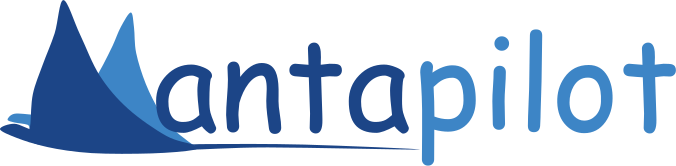
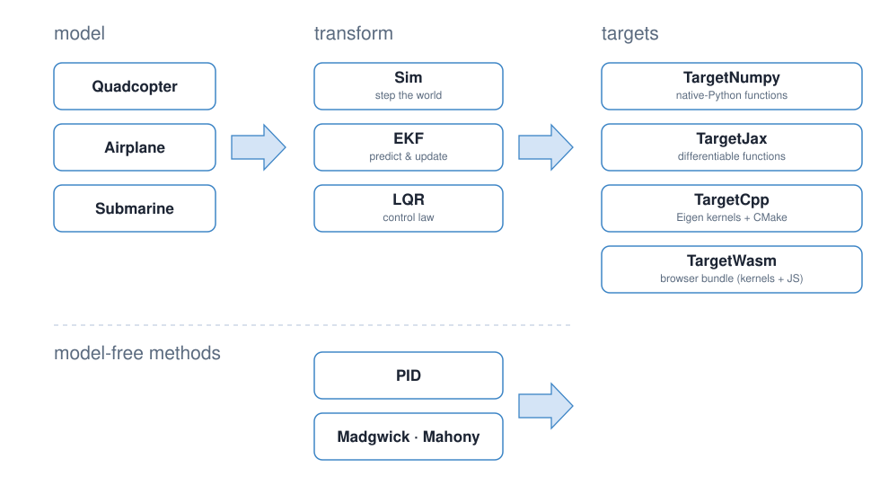

<p align="center">
  <a href="https://mantapilot.org">
    
  </a>
</p>

<p align="center">
  <a href="https://mantapilot.org"><b>mantapilot.org</b></a>
</p>

A Python-first, CasADi-backed framework for small vehicles — drones,
rockets, underwater vehicles, satellites — spanning rigid-body
simulation, state estimation (EKF), and control synthesis (LQR). You
declare the craft and its physics; manta builds the symbolic graph,
runs it natively in Python, and (when you're ready) lowers it to
embedded C++ via codegen.

## The pipeline

Three layers, explicit at every boundary. The model is declarative; the
**transforms** (`Sim`, `EKF`, `UKF`, `LQR`, the recurrence blocks) are siblings
over it, each owning its math and emitting a typed `Module` IR; a
`Target*` lowers any Module to a backend.

<p align="center">
  
</p>

`Sim(world)`, `EKF(world)`, `UKF(world)`, `INS(world, imu=…)`, and
`LQR(world, …)` are pure
compile-time.
Each writes its math symbolically over the shared `LinearizedSystem`
(manifold-aware F / B / H / L over the compiled world tick) and emits a
typed `Module` — state layout + named CasADi kernels + typed entry
points — that isn't directly callable. A `Target*` lowers the Module:
`TargetNumpy` to the one native-Python `NumpyRuntime` (its surface is
derived from the Module's shape), `TargetCpp` to a typed Eigen C++
class. Backends contain no per-transform code.

## Quick example

```python
import numpy as np

from manta import World, Craft, Sim, EKF, TargetNumpy
from manta.fields import GravityField
from manta.parts import IMU, Mass, PositionSensor, Thruster

# Model.
drone = Craft("drone")
drone.add(Mass("body", mass=1.5, moi=(0.05, 0.05, 0.08)))
drone.add(Thruster("t", force=(0, 0, 1)))
drone.add(IMU("imu", gyro_noise_sigma=0.005, accel_noise_sigma=0.05,
              gyro_bias_sigma=1e-4))
drone.add(PositionSensor("gps", position_noise_sigma=0.02))

w = World().add_field(GravityField(g=(0, 0, -9.81)))
w.add_craft(drone, position=(0, 0, 5))

# Build the transforms, lower to native-Python.
sim = TargetNumpy(Sim(w))
ekf = TargetNumpy(EKF(w))

# Run. The sim runtime holds the state: mutate `sim.state`, step by dt.
# The filter loop is update-then-predict: a reading sampled at the
# interval start belongs against the current (pre-predict) state.
sim.state["drone"]["t.throttle"] = 1.5 * 9.81       # hover
for t in np.arange(0, 3, 0.005):
    sim.step(0.005, t=t)                            # advance truth
    reading = sim.outputs()                         # sensor readings, this step
    ekf.update("imu.gyro", reading["drone"]["imu.gyro"], t=t)
    ekf.update("gps.position", reading["drone"]["gps.position"], t=t)
    ekf.predict(dt=0.005, t=t, u={"t.throttle": 1.5 * 9.81})

print(ekf.state_dict()["drone"]["position"])
```

To lower the same model to C++ for embedded use:

```python
from manta import TargetCpp
TargetCpp(Sim(w), "out", class_name="Drone")
# → out/{drone.hpp, drone.cpp, drone_kernels.c/h, CMakeLists.txt}
```

### Closed-loop control

`LQR(world, …)` synthesizes a state-feedback regulator about an operating
point — the third sibling transform. It regulates a controllable subset
(`regulate=`), freezing the rest; the runtime maps a state estimate to
commands:

```python
from manta import LQR

# 3-axis thrust makes position + velocity controllable with attitude
# frozen at the operating point. (A single-thruster craft regulates
# through attitude instead — see the quadcopter demo.)
drone.add(Thruster("tx", force=(1, 0, 0)))
drone.add(Thruster("ty", force=(0, 1, 0)))

lqr = TargetNumpy(LQR(
    w,
    x_ref={"drone": {"position": (0, 0, 10), "velocity": (0, 0, 0)}},
    u_ref={"t.throttle": 1.5 * 9.81},          # hover trim
    regulate=["drone.position", "drone.velocity"],
    Q=np.diag([10, 10, 10, 1, 1, 1]), R=np.eye(3), dt=0.02))

u = lqr.control(ekf.state_dict())              # {input_name: command}
```

(Q/R here are LQR *cost* weights, not the EKF's noise. A free rigid body
is underactuated, so full-state LQR isn't stabilizable — regulate the
controllable subspace via `regulate=`.)

## Core concepts

### Parts

A `Part` is an atomic unit of behavior on a craft. Declares at class
scope:

- `Parameter(default)` — frozen at construction, baked into the graph.
- `State(init, manifold="R1"|"R3"|SO3Manifold(...))` — mutable per-tick
  state; SO(3) slots carry an orientation (IMU integrators, attitude
  filters) with manifold-correct boxplus.
- `Input(default)` — per-tick user-supplied value (e.g. throttle).
- `Output()` — per-tick observable (sensor reading); shape is inferred
  from what the part writes into `PartUpdate.outputs`.
- `WhiteNoise(signal_manifold="R3", *, frame=None, sigma=...)` — per-tick
  i.i.d. Gaussian noise. `RandomWalkNoise(...)` — RW bias state
  (synthesizes its own state slot + driver input). Both subclass `Noise`.

Stock parts: `Mass`, `PointBuoy`, `DisplacementHull` (a distributed,
surface-piercing buoyancy/drag composite), `Collider`, `Thruster` (polynomial
in throttle), `RevoluteJoint` and `PrismaticJoint` (1-DOF joints, with Mass children for
rotors), `Motor` (voltage-commanded DC motor on a revolute DOF:
back-EMF torque-speed rolloff, current limit, gearbox),
`ThermalMass` (lumped thermal node — a purely coefficient-based heat
network, no spatial field: conduction links via `connect(other,
conductance=…)` where the W/K coefficient *is* the joint — metal
bracket, plastic standoff, heat pipe; an `ambient_conductance` leak to
either a scriptable `ambient_temperature` input or, with
`ambient="fluid"`, the FluidField's temperature at the part's position
— a hull node feels the water it is in; and a `source=` hook that reads
any part's `dissipated_heat()` — a Motor's i²R winding loss heats its
node with no extra wiring), a radial lumped-DC electrical network
(`DCSource`, `ElectricalBus`, `DCConverter`, `Contactor`, `Fuse`, and
constant resistance/current/power loads) whose connectivity is independent
of the mechanical tree and lowers through simulation, estimation, and codegen,
plus opt-in powered motor, propulsor, servo, and compute-load variants that
leave existing direct-command callers unchanged,
`DragSurface`, `Aerofoil` (Re-aware, with the `naca()` helper)
and `ControlSurface`, `IMU` (gyro+accel, with Kalibr 4-parameter noise
model), `VelocitySensor`, `Magnetometer`, `PositionSensor`, `Barometer`,
`TetherEndpoint`.

### Fields and Disturbances

Each `Field` (one of `GravityField`, `FluidField`, `MagField`,
`CollisionField`) is a typed superposition of `Disturbance` objects.
Disturbances combine via per-disturbance flags:

- `"additive"` (default) — linear sum (gravity, B-field, a current or
  thruster wake on top of a regime).
- `"averaged"` — membership-weighted mean among the averaged
  contributions (overlapping wind bubbles compromise on the mean).
- `"baseline"` — a regime medium (an ocean, an atmosphere). Baselines
  layer by spatial membership rather than summing
  (`base ← (1 − w)·base + w·value`), so "which fluid am I in" is an
  alpha-composite override, not a sum of 1025 + 1.225 kg/m³.

Disturbances can carry State / Noise declarations like Parts —
this is how `WindBias`, `CraftWindBubble`, and friends become
estimable through the EKF.

### Planets

`Planet` (and the `Earth` preset) is a World-level entity that:

- Holds a planet-fixed frame (axis + rotation rate) and provides
  symbolic + numpy transforms between PlanetFrame and WorldFrame.
- Has a reference shape — sphere or oblate spheroid. `Earth` is the
  WGS-84 ellipsoid with geodetic up/altitude and lat/lon/alt helpers
  (`ecef_from_geodetic`, `geodetic_from_ecef`, `scene_at_geodetic`).
- Auto-registers standing disturbances on the world's shared fields
  (Earth: point-mass + J2 gravity, ocean + ISA atmosphere split at the
  ellipsoid via `PlanetFrameFluid`, the sea surface as a collision
  obstacle, dipole magnetic field).
- Provides initial-state factories — `earth.position(x, y, z)`,
  `earth.velocity(vx, vy, vz)` — that resolve to
  WorldFrame seeds at compile time via the planet's transform.

Multiple planets in one world are supported. Each planet's
disturbances superpose into the shared fields.

### EKF

`EKF(world)` builds the Error-State EKF IR over every craft + every
state-bearing disturbance:

- **Q auto-assembled** from declared `Noise` channels: process-noise
  contributions for any noise affecting the next-tick state are
  picked up via autodiff (`L · Σ · Lᵀ`); RW biases get `dt · σ²` on
  their slot diagonal automatically.
- **R auto-assembled** per sensor Output from the noise channels
  feeding that output.
- **State spec auto-built** by walking every craft + every
  disturbance; the EKF estimates per-craft rigid-body slots plus
  any user-declared State or RW-bias slots.
- **Manifold-aware updates** — SO(3) tangent for the
  rigid-body orientation, R3 for vec3 states, R1 for scalars.
  Joseph-form measurement update.

Lower to `TargetNumpy(EKF(w))` for Python or `TargetCpp(EKF(w), ...)`
for embedded.

### UKF

`UKF(world)` is the unscented twin — same constructor, same held `x`/`P`,
same auto-assembled `Q`/`R`, and the **same emitted Module**, so it lowers
to every backend (`TargetNumpy`/`Cpp`/`Jax`/`Wasm`) through the EKF's path
with no new backend code. It replaces the linearized `F P Fᵀ` / `H P Hᵀ`
push with a sigma-point sample of the *nonlinear* `f`/`h` retracted onto
the manifold (no Jacobians), tuned by the standard scaled-UT `alpha`/`beta`/
`kappa`. Drop-in for the `EKF` above:

```python
from manta import UKF, TargetNumpy
ukf = TargetNumpy(UKF(w))        # identical predict/update surface
```

### INS

`INS(world, imu=...)` keeps EKF/UKF's held `x`/`P` Module and
`update`/`predict` surface, but replaces dynamics-driven navigation
propagation with strapdown integration of one selected IMU. Its state contains
position, orientation, velocity, the selected IMU biases, and structurally
relevant disturbance states; it deliberately has no angular-velocity slot and
does not form a gyro or torque-model residual. Algebraic angular constraints
(for example NHC or coordinated-turn observations) remain ordinary sensor
parts.

Dynamics enter through a normal pseudo-sensor rather than special filter code.
Mount `ModelForce` at the IMU frame: its `specific_force` output predicts the
compiled model's accelerometer sample, including actuator forces, fluid loads,
lever-arm acceleration, and estimable disturbances. Feed the same raw
accelerometer sample to that update and to strapdown prediction:

```python
from manta import INS, TargetNumpy
from manta.parts import IMU, ModelForce

imu = IMU("imu", accel_noise_sigma=6.9e-3,
          gyro_noise_sigma=1e-3, accel_bias_sigma=1e-4,
          gyro_bias_sigma=1e-5)
craft.add(imu)
craft.add(ModelForce("model_force", imu=imu,
                     model_error_sigma=0.5))

ins = TargetNumpy(INS(
    world, imu="imu", sensors=["model_force.specific_force"],
))
sample = {"imu.accel": accel, "imu.gyro": gyro}
ins.update("model_force.specific_force", accel, u=sample)
ins.predict(dt, u=sample)
```

The innovation `r_f = f_IMU - f_model` has
`∂r_f/∂δb_a = -I`: it is an accelerometer-bias and external-force
disturbance observer, not generic model aiding. A `CraftWindBubble.wind`
random-walk slot, for example, is retained when the compiled force prediction
depends on it and can be estimated through this output.

The IMU sample appears in both propagation and the force residual, so their
noise is formally correlated. Manta follows the intended separated-noise
regime and records/logs `rho = accel_noise_sigma / model_error_sigma` for each
`ModelForce`. Manta does not impose a threshold: the acceptable range depends
on the identified model error, spectra, operating envelope, and vehicle risk
policy. Noise declarations are per sample. Convert an accelerometer noise
density to the effective sample sigma at the logging interval before declaring
it (for example `100 µg/√Hz / sqrt(20 ms) ≈ 6.9e-3 m/s²`).

`observability`, `observability_trajectory(..., estimator=ins)`,
`nees(..., estimator=ins)`, and `NoiseFit(..., estimator=ins)` consume the same
estimator IR and sensor declarations. CasADi differentiates the complete INS
tick to obtain `F`; finite differences are a test oracle, not a second
hand-maintained Jacobian.

### System identification (Fit)

`Fit(world, parameters={...})` fits a model's physical parameters to
recorded data. Promotable `Parameter`s (those declared with a manifold:
thruster gains, every part's `mount_offset`/`mount_orientation`,
`Mass.mass`) are
promoted from baked graph constants to a live parameter vector
(`Sim(world, parameters=[...])` → a `params` port on every kernel), and
the fit minimizes windowed prediction error against logged controls +
sensor readings, MAP-regularized by per-parameter Gaussian priors:

```python
fit = Fit(world, parameters={
    "body.mass":     Prior(sigma=0.05, log=True),   # weighed: ±5%
    "t1.force_quad": Prior(sigma=4.0, upper=(0, 0, 25.0)),  # motor rating
    "t2.force_quad": Tied("t1.force_quad"),         # identical motors
    "t3.force_quad": Tied("t1.force_quad"),
    "t4.force_quad": Tied("t1.force_quad"),
    "arm":           Free(0.12, prior=Prior(sigma=0.02, lower=0.0)),
    "t1.transform":  Tied("arm", scale=[[1], [1], [0]]),    # one arm
    "t2.transform":  Tied("arm", scale=[[-1], [1], [0]]),   # length, four
    "t3.transform":  Tied("arm", scale=[[-1], [-1], [0]]),  # mounts
    "t4.transform":  Tied("arm", scale=[[1], [-1], [0]]),
    "imu.transform": Prior(sigma=0.10),             # lever arm: ±10 cm
})
result = fit.solve(windows, weights={"imu.gyro": 1/σg**2,
                                     "imu.accel": 1/σa**2})
print(result.summary())     # fitted values + prior σ vs posterior σ
artifact = result.derive(validation={"accepted": True,
                                     "holdout_rmse": heldout_rmse})
# Or, for an exploratory authoring loop, mutate the editable World:
result.apply()
```

Structure is enforced, not hoped for: `Tied` pins symmetric parameters
to one decision variable (an affine map covers mirrored mounts and
shared scalars like the arm length above, via `Free`), and
`Prior(lower=, upper=)` walls off physically absurd optima — so the
fitted model stays the declared vehicle and generalizes across a fleet
instead of memorizing one airframe's data.

Gradients are exact (the oracle `step` kernel folded over each window
via `mapaccum`), IPOPT solves the NLP, and the Gauss-Newton posterior
`(JᵀJ + Σ₀⁻¹)⁻¹` reports which parameters the data actually informed:
`post/prior ≈ 1` means that number came from your prior, not the data,
and `result.weak_directions()` names the unidentifiable parameter
combinations (e.g. the thrust/mass scale). See
`examples/vehicles/sysid_drone.py` for the full recoverability demo.

Noise σ values are fit separately — a mean-prediction L2 loss has zero
gradient in σ. `NoiseFit(world, noise={...})` runs a symbolic Kalman
filter over the same `Window`s and minimizes the innovation
negative-log-likelihood (σ enters through the filter's `Q = LΣLᵀ` and
`R = L_hΣL_hᵀ`), fitting log-σ with relative priors:

```python
nres = NoiseFit(world, noise={"imu.gyro_noise": Prior(sigma=2.0),
                              "imu.accel_noise": Prior(sigma=2.0)})\
    .solve(windows)
nartifact = nres.derive(validation={"accepted": True,
                                    "heldout_nis": heldout_nis})
# nres.apply() remains available for an editable authoring workflow.
```

### Sparse RTI MPC

`MPC` is a direct solver-backed runtime over a complete `World`. It uses
tangent-space direct multiple shooting, hard native actuator bounds, an
elastic Euler-free bank envelope, optional hard scheduled SO(3) attitude-error
envelopes, one SQP/QP update per tick, and a shifted nonlinear warm trajectory.
`controlled=` may name one or several crafts; the
reference map must cover exactly those crafts, while uncontrolled crafts and
couplings remain in the predicted dynamics.

`compile=True` compiles and caches fused horizon rollout/linearization,
horizon-objective, and accepted-plan bank-diagnostic kernels with a
controller-specific runtime optimization profile (`-O3` and the local target
architecture). The generic codegen path remains at its
compile-time-conscious profile. Fixed-shape NumPy assembly buffers are reused
between ticks instead of rebuilding horizon arrays through Python lists.

`qp_backend="osqp"` uses a persistent sparse workspace through a small native
bridge to CasADi's bundled OSQP library: only numeric values and bounds change
each tick, with no generic conic or `DM` marshalling. Its convergence check,
matrix-update/refactorization time, ADMM iteration time, residuals, and rho
updates are exposed for replayable tuning; convergence is checked every five
iterations by default instead of OSQP's stock interval of 25.

`qp_backend="hpipm"` selects Manta's optional native optimal-control QP
workspace over CasADi's bundled HPIPM/BLASFEO libraries. It preserves the
direct-shooting objective by augmenting each stage state with the previous
control correction for slew cost, and keeps bank slack stage-local.
`qp_options={"condense_to": K}` enables HPIPM partial condensing while the
uncondensed problem remains available with `K=0`. OSQP remains the default and
reference implementation while structured-solver results are promoted
vehicle by vehicle. The native workspace owns its stage scratch vectors, so a
steady-state solve performs no per-stage heap allocation.

Fixed sparse scatters and actuator slew/bound blocks are vectorized NumPy. The
ordinary structure omits scheduled SO(3) constraint rows; Manta switches to a
constrained structure only when a reference supplies that envelope.
`MPCResult` exposes the nominal state/control plan, constraint metrics, solver
status, and split timings for benchmarking.

Further performance experiments and their behavioral gates are recorded in
the [RTI MPC optimization roadmap](docs/explanation/mpc-optimization.md).

### Backends

The `manta.codegen` package houses the lowering. Every transform emits
the same typed `Module` IR (state layout + named CasADi kernels + typed
entry points), and each backend implements exactly ONE generic lowering
of a Module — no per-transform code anywhere:

| Target | Accepts | Produces |
|---|---|---|
| `TargetNumpy(x)` | any Module / transform | `NumpyRuntime` — surface derived from the Module's shape (sim `step`/`outputs`, filter `predict`/`update`, regulator `control`, recurrence `step`) |
| `TargetFilterReplay(x, max_operations=…, max_checkpoints=…)` | EKF/UKF Module / transform | bounded native exact-sequential span executor over caller-ordered predicts, updates, and checkpoint boundaries |
| `TargetCpp(x, out_dir, class_name)` | any Module / transform | C++ static lib: typed Eigen class over flat-C kernels (+ CMake) |
| `TargetJax(x)` | any Module / transform | `JaxModule` — every kernel as a jitted JAX function + a `lax.scan` rollout you can `jax.grad`/`jax.vmap` through (needs `pip install jax`; not a core dependency) |
| `TargetWasm(x, out_dir, class_name)` | any Module / transform | browser bundle: the C++ backend's flat-C kernels behind a flat-double C ABI + Emscripten `build.sh`, a JSON descriptor, and an ES-module JS runtime (generic `Runtime.call` + typed `Sim`/`Filter`/`Regulator` views mirroring the numpy ones) |

`TargetJax` lowers by expanding each kernel to a CasADi SX instruction
tape and emitting equivalent JAX source (one line per scalar op) —
outputs match CasADi to machine precision, and `jax.grad` matches
CasADi jacobians exactly. Articulated (jointed) crafts — whose
joint-space solve keeps a runtime-pivoting Linsol node that can't
SX-expand — are handled by cutting the graph at each solve node and
recomposing around `jnp.linalg.solve` (LAPACK's pivoted LU, the same
class of solve), so they lower and differentiate like everything else.

`TargetWasm` reuses `TargetCpp`'s exact math path (same densified flat-C
kernels) and adds only the marshalling glue, so the numbers match every
other backend bit-for-bit; it powers the live examples on
[mantapilot.org](https://mantapilot.org). The emitted JS dispatches purely
on the descriptor — no per-transform code — so `Sim`, `EKF`, and `LQR` all
get the same browser-ready surface.

Adding a backend (torch, raw embedded C) = a way to run/translate a
`ca.Function` plus one generic `Module` lowering. Solver-backed algorithms do
not have to pretend to fit that contract: sparse `MPC` is a direct runtime over
the world model, compiled numerical kernels, and a native OSQP solve.

## Layout

```
manta/                     library package
    __init__.py            World / Craft / Sim / EKF / LQR / Target* surface
    craft.py               Craft + TickContext + inertial/wrench helpers
    world.py               World (the declarative model)
    sim.py                 Sim (forward-dynamics transform)
    fit/                   Fit (MAP system ID) + NoiseFit (innovation-NLL σ fit)
    recurrence.py          RecurrenceBlock base (PID/Madgwick/Mahony/IMU)
    linearization/         LinearizedSystem (system) + TickLinearizer
                           (engine) + closure/partition + name helpers —
                           the shared seam every transform reads
    smoothing.py           Shared softened-norm / smooth-max primitives
    tick/                  World-tick compile + kinematics/inertia/signature
    ir/                    Frames, types, Graph, Manifold, Wrench, Module
    parts/                 Part base + stock parts (sensor/actuation/aero/…)
    fields/                Field + Disturbance + stock + CraftWindBubble
    planets/               Planet base, Earth, PlanetFrameFluid, PlanetState
    couplings/             Coupling ABC + Tether
    estimation/            EKF/UKF + observability/NEES + recurrence filters
                           (state layout — StateSpec — lives in ir/, not here)
    control/               LQR + PID + sparse tangent-space RTI MPC
    codegen/               Backends (one generic Module lowering per target)
        target.py          as_module — the backend entry-point contract
        numpy/             TargetNumpy + NumpyRuntime engine + the four
                           views (_sim/_filter/_recurrence/_regulator)
        cpp/               TargetCpp + the generic module_emit emitter
        jax/               TargetJax (CasADi SX tape → jitted JAX source)
        wasm/              TargetWasm (flat-C kernels + C ABI + JS runtime)
tests/                     700+ tests (`pytest -q`; count moves — don't pin it)
examples/                  quickstart + physics/ + vehicles/
    _viz.py                rerun visualization helpers
    _control.py            keyboard (pynput) + scripted-fallback control
    quickstart.py          install sanity check (numpy Sim, apex height)
    physics/               bouncing_ball / spinning_top / foucault_pendulum
    vehicles/              quadcopter / airplane / submarine / hydrofoil
```

## Demos

Start with the install sanity check — a ball thrown into uniform gravity,
run on the numpy backend, reporting the apex height it reached:

```bash
.venv/bin/python -m examples.quickstart
```

The rest are organized into **physics** (each with a [rerun](https://rerun.io)
3-D visualization) and **vehicles** (visualization + keyboard control, with
a self-running scripted fallback so they work unattended):

```bash
# physics/ — visualized
.venv/bin/python -m examples.physics.bouncing_ball       # Collider + CollisionField
.venv/bin/python -m examples.physics.spinning_top        # gyroscopic precession (RevoluteJoint)
.venv/bin/python -m examples.physics.foucault_pendulum   # Planet + Tether + Coriolis

# vehicles/ — visualized + keyboard (add --keyboard for live control)
.venv/bin/python -m examples.vehicles.quadcopter         # Sim + EKF + LQR closed loop
.venv/bin/python -m examples.vehicles.airplane           # control surfaces on RevoluteJoint hinges
.venv/bin/python -m examples.vehicles.submarine          # PointBuoy + VelocitySensor + EKF
.venv/bin/python -m examples.vehicles.hydrofoil          # nested-RevoluteJoint laser gimbal (PID)

# system identification — headless, no rerun needed
.venv/bin/python -m examples.vehicles.sysid_drone        # Fit + NoiseFit: thrust/mass/mounts/σ from IMU logs
.venv/bin/python -m examples.vehicles.sysid_quad_tied    # Tied/Free: fit a DESIGN, then predict a second airframe
```

Visualized demos need the rerun SDK (`.venv/bin/pip install rerun-sdk`); pass
`--no-viz` to run any of them headless. Vehicle demos take `--keyboard`
(live control: reads the launching terminal on WSL/headless boxes, a global
`pynput` listener on native desktops), `--no-viz`, `--duration`, and
`--viz-addr HOST[:PORT]` to stream to an already-running viewer (e.g. a
GPU-rendered Windows-native viewer from WSL). Shared helpers live in
`examples/_viz.py` (rerun) and `examples/_control.py` (keyboard / scripted).

## Running tests

```bash
.venv/bin/python -m pytest tests/
```

## Status

In active development. The public API (`World`, `Craft`, `Sim`, `EKF`,
`UKF`, `LQR`, `MPC`, `TargetNumpy`, `TargetCpp`) is settled enough that the demos
and tests don't carry compat shims. The full deploy-to-robot path
lowers to C++ — `TargetCpp` handles `Sim`, `EKF`/`UKF` (mutable state +
covariance update), and `LQR` (feed-forward control law), each verified
against the
numpy backend by a compile-and-run roundtrip test. Open items:

- **Sparse RTI MPC** (shipped — `manta.control.rti`) — direct multiple
  shooting over the complete coupled world, with tangent-space state
  increments, one reference per controlled craft, hard actuator bounds, an
  elastic Euler-free bank envelope, shifted nonlinear plans, fused compiled
  horizon kernels, and a persistent native OSQP workspace. Constrained and
  ordinary references select separate fixed sparse structures. MPC is intentionally
  not a `Module` transform and does
  not lower through unrelated backends.
- **Observability analysis** (shipped — `manta.estimation.observability`)
  — a faithful EKF of a correct model is still only as good as the model's
  *observability* (a property of dynamics + sensor set + **operating
  point**, not of the model alone): unobservable modes drift silently
  while the covariance looks tight. `observability(EKF(world))` builds
  the observability matrix from the
  symbolic `F`/`H` at an operating point and reports rank + which state
  slots are unobservable (+ an orthonormal **observable basis**). It flags,
  e.g., that GPS + DVL + gyro can't see absolute heading **at rest**. Local
  by nature; `observability_trajectory(world, dt=, steps=, control=)` rolls
  out a maneuver and reports the **union** of local observability over it —
  capturing observability-through-motion (that same heading *is* observable
  while the vehicle moves, rank 11→12).
- **NEES consistency check** (shipped — `manta.estimation.nees`) — the
  complement to observability: observability asks what you *can* estimate;
  NEES asks whether the filter's reported *covariance* is honest (a
  fully-observable filter can still be overconfident and quietly diverge,
  or conservative and waste information). `nees(world, dt=, steps=,
  control=)` runs a Monte-Carlo ensemble (truth jittered by the model's
  process noise, measurements by their R, the initial estimate drawn from
  P₀) and reports ANEES vs the χ² band. Pass `observable_basis=` (from an
  observability report) to check consistency only where the state is
  observable. **This settled the auto-`Q` question:** the *full-state* NEES
  reads overconfident only because the EKF shrinks covariance on the
  unobservable attitude; in the **observable subspace the filter is
  consistent**, and the auto-`Q` (`L·Σ·Lᵀ`) is exact for the dynamics-noise
  states — so it was left as-is (tightening it would have masked a sensor
  observability issue). The residual overconfidence on unobservable
  directions is the known EKF-inconsistency-on-unobservable-modes problem;
  FEJ / observability-constrained EKF is the principled fix (future).
- **EKF measurement timing** (fixed) — the filter's `step` folds a
  measurement *before* propagating over its interval (update-then-predict),
  because the sim emits sensor outputs from the interval's *start* state.
  The old predict-then-update order met a start-of-interval reading with
  the end-of-interval state, biasing rate-derived states (orientation) by
  O(dt) — a gyro-only EKF drifted heading where a naive integrator didn't.
  Fixing it collapsed that error to ~0 (submarine est error: 2.2 m peak →
  ~4 mm). `VelocitySensor` also gained a `velocity_noise` channel (it had
  none, so its EKF R was singular).
- **Multi-craft EKF over coupled worlds** — works for parallel
  independent crafts (block-decomposed predict is wired); field-mediated
  cross-craft coupling in the *estimator* is untested at scale.
- **Parameter tuning** — planned; the design is an
  offline IPOPT fit of `tunable` Parameters against logged trajectories.

## License

See `LICENSE`.
